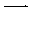
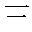

.. Chinese Input Methods master file, created by sphinx-quickstart on
   Fri Jul 27 22:38:40 2012.

=====================
Chinese Input Methods
=====================

Introduction
============

This document aims to introduce to non-Chinese how Chinese Input Methods work.

It can be a simple reference for developers of Operating Systems outside of
China who want to enable Chinese users to input their own language.

It should be considered a work in progress and might be incomplete or contain
some mistake. Feel free to :ref:`contact me <authors>` if you want to add/fix
something.

I started it because I wanted to help `GNOME`_ developers get
a better understanding of the needs of the :ref:`Hong Kong <hong-kong>`
community while IBus was being integrated to GNOME 3.6.

.. _chinese-languages:

Written Chinese languages
=========================

There are mostly two written Chinese languages: Simplified and Traditional
Chinese.

Mainland China writes in Simplified Chinese, while
:ref:`Hong Kong <hong-kong>`, Macau and Taiwan write in Traditional Chinese.

Types of Chinese input methods
==============================

There are two big classes of Chinese input methods. Each one will be detailed
in the next two sections.

.. _sound-based:

IM based on the sounds of words
-------------------------------

A user of those will type the romanization of the Chinese character, i.e how a
word in the Latin alphabet could be written to produce the sound of that
character.

For example, 我 (the pronoun "I" or "me") is pronounced something like "wo".
So a Pinyin user will type those two characters, "w" then "o", and one of the
suggestions will be 我.

Examples of these include Pinyin and Bopomofo.

.. _stroke-based:

IM based on the strokes necessary to write a word
-------------------------------------------------

These are based on the strokes necessary to write a character.

For example, with a pen and paper, to write 三 (the number 3), one needs to:

* first write the first stroke: |three-first|,
* then add the second one: |three-second|,
* and finish with the last stroke: |three-third|

This is much like when writing a "p", one would start by "drawing" the
vertical bar, then add the round part.

In a stroke-based input method, each type of stroke (vertical, horizontal,
curved, ...) is associated to a character of the latin alphabet on the
keyboard.

And then one has to type **in the right order** the series of characters
corresponding to the series of strokes necessary to write the full character.

In the above (trivial) example of the number 3, the horizontal stroke
corresponds to the "m" key in the Cangjie (version 3) input method. So to
input the number 3, the user would have to press three times the "m" key.

Cangjie, Quick or hand-writing (either with pen and paper or with a touch
screen device) are all examples of stroke-based input methods.

Most used Chinese input methods
===============================

.. note::
    This document was written and reviewed primarily by people in Hong Kong.
    If we made any mistake for the other regions using Chinese input methods,
    please :ref:`let us know <authors>`.

The most used Chinese input methods are the following:

* Pinyin is a :ref:`sound-based input method <sound-based>`. It is used mostly
  in Mainland China, to input :ref:`Simplified Chinese <chinese-languages>`.
* Bopomofo is a sound-based input method. It is used
  mostly in Taiwan, to input :ref:`Traditional Chinese <chinese-languages>`.
* Cangjie is a :ref:`stroke-based input method <stroke-based>`. It is used
  mostly in :ref:`Hong Kong <hong-kong>`, to input Traditional Chinese.
* Quick is a stroke-based input method. It is used mostly in Hong Kong, to
  input Traditional Chinese.
  Note that :ref:`Quick is based on Cangjie <quick>`.
* Hand-writing is effectively a stroke-based input method. It is used
  everywhere people write on a piece of paper, or on a touch screen, to input
  any :ref:`Chinese language <chinese-languages>`.

.. _hong-kong:

The situation in Hong Kong
==========================

.. _cangjie-quick:

Cangjie and Quick
-----------------

Cangjie is a very classic :ref:`stroke-based input method <stroke-based>`, as
explained above. Every word is represented by a combination of 4 keys.

.. _quick:

Quick is based on Cangjie, with a simple change to make it easier and reduce
the number of keys needed before getting suggestions to only 2: the user only
types the first and last key, corresponding to the first and last stroke in
Cangjie.

.. _cangjie-quick-languages:

Multiple languages
------------------

Cangjie (and Quick as it is :ref:`based on Cangjie <quick>`) were designed to
input the characters of 3 different languages:

* Traditional Chinese
* Simplified Chinese
* Japanese

Its design is clever enough to limit "collisions" (i.e a given combination of
4 keys returning candidates in more than one language) to a minimum, and for
rarely used characters or slow to type combinations.

As such, most of the time, a Cangjie user will only be presented with
candidates in the language he is expecting based on his input. (unless he is
not using the :ref:`version <versions>` he thinks he is)

.. _versions:

Different versions
------------------

The Cangjie input method (not its :ref:`implementation <implementations>` in a
given Operating System) was first published in 1976.

Since then, a few different versions have been published, each slightly
incompatible with each other.

.. todo::
    Get an example of a character and how to type it in Cangjie 3, 4 and 5.

For example, the word "XXX" (YYY) will be inputted differently in each version:

* "ZZZZ" in Cangjie 3
* "ZZZZ" in Cangjie 4
* "ZZZZ" in Cangjie 5

These incompatibilities mean that users will have to spend some time learning
a new version, almost as if it were a different input method.

.. _school:

Schools and education
---------------------

Schools teach Cangjie :ref:`version 3 <versions>`. This has a lot to do with
inertia: Cangjie 3 is the default on :ref:`Microsoft Windows <windows>`, and
the latter in turn defaults to version 3 because it's what is taught at school.

.. _used:

What people use
---------------

After learning :ref:`at school <school>`, most people will move from
:ref:`Cangjie to Quick <cangjie-quick>`.

This is because the former has a much steeper learning curve than the latter,
which is much easier to use.

However, many people stick to Cangjie because, once they have made the effort
to learn it properly, it allows them to type much faster.

In any case, the overwhelming majority uses :ref:`version 3 <versions>` of
their input method of choice, with the rest mostly using
:ref:`version 5 <versions>`.

.. _stroke5:

Stroke 5 for a11y
-----------------

Stroke 5 is an input method which was created for the elderly and people with
reduced hand mobility.

It is :ref:`stroke-based <stroke-based>`, just like
:ref:`Cangjie and Quick <cangjie-quick>`.

However, to allow typing with few fingers and with relatively few movements,
only 5 keys are used:

.. todo::
    Give some more details...

In Hong Kong, some groups are showing tremendous results with Stroke 5, giving
access to electronic devices and the Internet to people who traditionally
couldn't input their own language on a keyboard before.

.. _implementations:

Implementations on some popular OSes
------------------------------------

.. _windows:

Windows
*******

Microsoft Windows provides both Cangjie and Quick, both in :ref:`version 3 <versions>`.

.. note::
    Microsoft Windows is used by virtually everybody in Hong Kong, both
    :ref:`at home, at school and at work <used>`.

Since Windows 7, it offers to optionally enable the results of respective
version 5. But that is **in addition** to the results of version 3. This
option effectively enables :ref:`what IBus calls "Cangjie Big" <cangjie-big>`.

Mac OS X
********

Mac OS X provides Cangjie and Quick, both in :ref:`version 4 <versions>`.

Most Mac users of Cangjie in Hong Kong will install the Yahoo input method
framework instead of using the default system one, as it allows them to use
Cangjie 3 as they are used to.

Quick users tend to not bother. This is because, given the design of Quick,
very few things changed between :ref:`versions 3 and 4 <versions>`.

GNOME 3
*******

.. note::
    This is pretty much a work in progress at the moment, hopefully things
    should land in GNOME 3.6.

`GNOME`_ uses `IBus`_ as its Input Method Framework.

IBus provides implementations of :ref:`Cangjie, Quick <cangjie-quick>` and
:ref:`Stroke 5 <stroke5>` through IBus Table.

For both Cangjie and Quick, :ref:`versions 3 and 5 <versions>` are available.

.. _cangjie-big:

.. todo::
    Reuse the example from the :ref:`versions section <versions>`.

IBus Table also provides what it calls Cangjie "Big", which is the combination
of both versions 3 and 5. For example, one can get the word XXX...

For Quick, IBus Table also provides Quick "Classic", which is completely
obsolete these days.

Since Cangjie and Quick allow inputting characters in
:ref:`3 different languages <cangjie-quick-languages>`, IBus Table has a filter
(which it calls by the slightly misleading name "Chinese Mode") that the user
can set at run time to control for which language(s) the user will get
suggestions:

* if set to "0", only characters in Simplified Chinese will be suggested,
* if set to "1", only characters in Traditional Chinese will be suggested
  (this is obviously the best choice for Hong Kong users),
* if set to "2", characters in all 3 languages will be suggested, but
  Simplified Chinese characters will appear first,
* if set to "3", characters in all 3 languages will be suggested, but
  Traditional Chinese characters will appear first,
* if set to "4", characters in all 3 languages will be suggested (the order in
  this case is unclear)

.. _authors:

Authors
=======

This document was written by Mathieu Bridon (bochecha). You can contact me
`by email <mailto:bochecha@fedoraproject.org>`_.

I have to thank Wan Leung Wong for his patience and the time he took to
explain all these things to me. This document wouldn't exist without him.

.. todo::
    Get this thing proof-read by some people in the HK community.

This document is distributed under the Creative Commons Attribution
Share-Alike 3.0 Unported license (`CC-By-SA`_).

.. Links
   =====

.. _GNOME: https://www.gnome.org
.. _IBus: http://code.google.com/p/ibus/
.. _CC-By-SA: http://creativecommons.org/licenses/by-sa/3.0/
